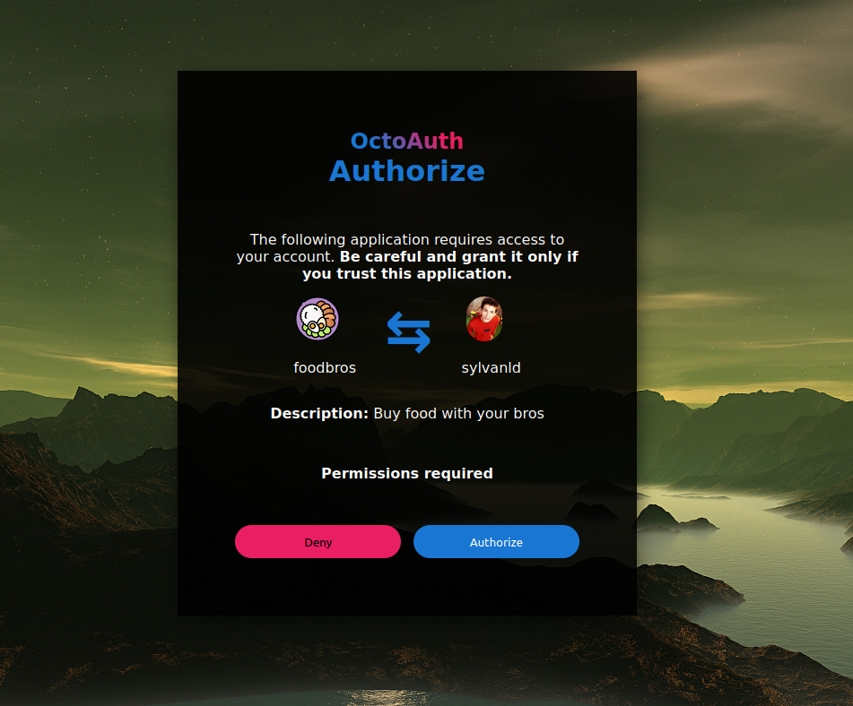

# OctoAuth

*Oauth2 provider that exposes a REST API for third-party applications*

## Quickstart

This section help you to quickly setup a èdevelopment version of OctoAuth API using docker-compose.

1. Create a folder that will contains OctoAuth assets.

```
mkdir assets/
```

2. Generate an RSA private key that will be used to sign JWT.

```
openssl genrsa -out assets/private-key.pem 4096
```

3. Create a docker-compose containing the following:

```yaml
version: "3.6"

services:
  octoauth:
    image: sylvanld/octoauth
    ports:
      - 8000:80
    volumes:
      - ./assets/:/octoauth/assets
    environment:
      OCTOAUTH_DASHBOARD_URL: "http://localhost:5000"
      OCTOAUTH_DATABASE_URL: "sqlite:///:memory:"
      OCTOAUTH_MAILING_ENABLED: "false"
```

4. Start container using docker-compose

```
docker-compose up octoauth
```

5. Let's try to use the API, first export API address

```bash
export OCTOAUTH_URL="http://localhost:8000"
```

6. Then create an Oauth2 client application

```bash
curl -X POST "$OCTOAUTH_URL/api/oauth2/applications"    \
    -H 'Content-Type: application/json'                 \
    -d '{"name": "My Application", "client_id": "myapp", "description": "Example Oauth2 application"}'
```

You should get a response like

```json
{
    "uid":"ed3223592c1b4335af581418e3d13ae1",
    "name":"My Application",
    "description":"Example Oauth2 application",
    "client_id":"myapp",
    "icon_uri":null,
    "client_secret":"1d2e8f424ca94d5c85103d9981d3a64d"
}
```

7. Create a scope

```bash
curl -X POST "$OCTOAUTH_URL/api/oauth2/scopes"          \
     -H 'Content-Type: application/json'                \
    -d '{"code": "playlists:read", "description": "Read only access to all of your playlists!"}'
```

A confirmation is received

```json
{"code":"playlists:read","description":"Read only access to all of your playlists!"}
```

8. Now you can try to request access to this scope for your client application.

```bash
# open in your browser
firefox "$OCTOAUTH_URL/authorize?client_id=yolo&redirect_uri=http://localhost:6000&scope=profile:read&response_type=token&show_consent_dialog=true"
```



## Configuration

OctoAuth API can be configured using environment variables. 

**This is also true when using docker image.**

| Variable                 | Description                                                                                                                                                                  | Default value                                                              |
| ------------------------ | ---------------------------------------------------------------------------------------------------------------------------------------------------------------------------- | -------------------------------------------------------------------------- |
| OCTOAUTH_DASHBOARD_URL   | **REQUIRED**. URL of [octoauth accounts dashboard](https://github.com/sylvanld/octoauth-dashboard) which allows users to manage their account preferences and personal data. | -                                                                          |
| OCTOAUTH_DATABASE_URL    | **REQUIRED**. [URL used by sqlalchemy](https://docs.sqlalchemy.org/en/20/core/engines.html#database-urls) to connect to OctoAuth database.                                   | -                                                                          |
| OCTOAUTH_MAILING_ENABLED | Boolean defining whether email must be sent to notify users, for example when account is created, etc..                                                                      | false                                                                      |
| OCTOAUTH_JWT_PRIVATE_KEY | Path to an RSA private key [used to sign JWT](#jwt-private-key). If running OctoAuth in docker, don't forget to put it in a volume.                                          | `assets/private-key.pem` (path is relative to `/octoauth` in docker image) |

### JWT Private key

A private key is required to encode JSON Web Tokens using algorithm `RSA256`. This allow client to decode tokens without knowing encryption key nor making request to OctoAuth server, and those improve authentication system's scalability. A private key might be generated using `openssl` with the following command

```bash
mkdir assets/
openssl genrsa -out assets/private-key.pem 4096
```

## Contribute

**Requires**
- Python >= 3.8 / PIP (recommended to use virtualenv)
- make

To install psycopg2 (in dependencies) you need `libpq-dev`. It can be installed on ubuntu with

```bash
sudo apt install -y libpq-dev
```

Install dependencies

```bash
pip install -r requirements/dev.txt
```

Run server in dev. mode using uvicorn (included in dependencies)

```bash
uvicorn --reload --factory octoauth.webapp:OctoAuthASGI
```

Before publishing a merge request, please clean/format your code using

```bash
make format
```
